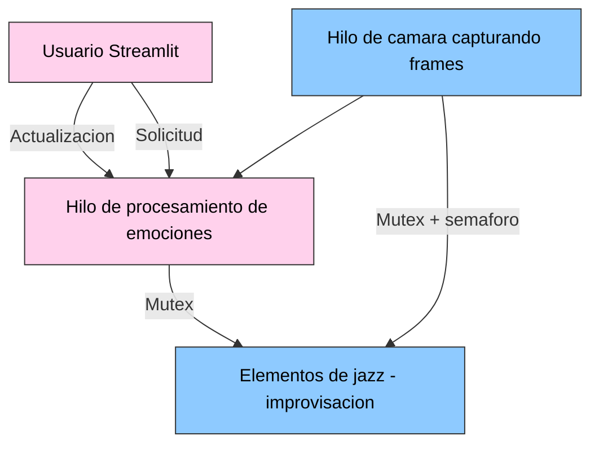
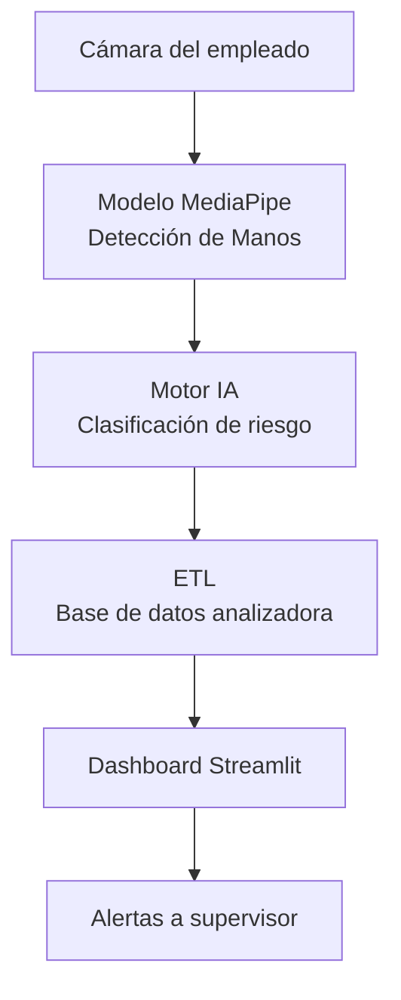

# Laboratorio 7
 
 # Punto 1. Punto 1 — Detector de Emociones con MediaPipe, Streamlit, Hilos, Semáforos y Mutex


### 1. Arquitectura General del Sistema

El sistema está dividido en tres hilos concurrentes:


Hilo 1 — hilo_camara()

Se encarga de:

Abrir la cámara

Capturar frames continuamente

Enviarlos a un buffer compartido

Liberar un semáforo indicando “hay un frame disponible”

 Hilo 2 — hilo_procesamiento()

Encargado de:

Esperar frames (semaforo.acquire)

Procesarlos con MediaPipe FaceMesh

Calcular medidas faciales

Determinar emoción

Generar frame anotado

Actualizar memoria compartida

 Hilo 3 — Interface Streamlit

Responsable de:

Mostrar video en tiempo real

Mostrar emoción detectada

# Sincronización: Semáforos y Mutex
Semáforo → frames_disponibles

Limita el procesamiento a solo cuando hay un nuevo frame.
Evita que el hilo de procesamiento quede adelantado o vacío.

Candado (Lock / Mutex)

Protege la sección crítica:

escritura/lectura del frame

actualización de textos

estado del sistema

Esto evita condiciones de carrera entre hilos.

Controlar encendido/apagado del sistema

# 2 MediaPipe Face Mesh — Cómo obtiene los puntos

MediaPipe Face Mesh genera 468 landmarks faciales, cada uno con coordenadas:

x (proporcional al ancho)

y (proporcional al alto)

El detector usa landmarks clave:
## Tabla de Regiones y Puntos de Landmarks

| Región                     | Puntos        |
|---------------------------|---------------|
| Boca izquierda/derecha    | 61 — 291      |
| Labio superior/inferior   | 13 — 14       |
| Ojo izquierdo             | 159 — 145     |
| Ojo derecho               | 386 — 374     |
| Cejas                     | 105 — 334     |
| Ancho de cara             | 33 — 263      |

```python
docker build -t analizador-sentimientos .
```
Ejecución
```python
docker run -p 8501:8501 analizador-sentimientos
```


 Sección Imágenes 

Interfaz principal

 Resultados de comentarios procesados

Contenedorización en Docker

 Aplicación corriendo en navegador

# 3. Clasificador Heurístico de Emociones
 Medidas geométricas extraídas

Ancho de boca

Apertura vertical de la boca

Curvatura hacia arriba/abajo

Separación ceja–párpado

Apertura ocular

Ancho de cara (para normalización robusta)

Felicidad
3. Clasificador Heurístico de Emociones
 Medidas geométricas extraídas

Ancho de boca

Apertura vertical de la boca

Curvatura hacia arriba/abajo

Separación ceja–párpado

Apertura ocular

Ancho de cara (para normalización robusta)

Felicidad
``` python

if boca_ancho_rel > 0.38 and boca_apertura_rel > 0.06 * 0.6:
    return "Felicidad"
```
Furia
``` python
if cejas_prom < 0.025 and apertura_ojos < 0.085:
    return "Furia"
``` 
 Tristeza

Pendiente de la boca negativa:
``` python
if pendiente_prom < -0.015:
    return "Tristeza"
``` 
Neutral

Por defecto si no cumple reglas.

# 4. Explicación del Código
 Hilo de cámara: usa cv2.VideoCapture, aplica flip horizontal tipo espejo, coloca el frame en memoria compartida bajo mutex, Lanza frames_disponibles.release()

 Hilo de procesamiento: espera frames con acquire(), Ejecuta FaceMesh, Calcula medidas y emoción, Anota frame con Landmarksm Actualiza memoria compartida bajo mutex

 Interfaz en Streamlit: Botón iniciar → activa ambos hilos, Botón detener → hace que ambos terminen

Muestra: Frame procesado (con mesh), Emoción detectada en texto

# 5. Sección para imágenes
## Capturas de Pantalla

###  Interfaz funcionando


###  Emoción felicidad detectada


### Emoción furia detectada


### Emoción tristeza detectada


### Emoción neutral detectada


### Aplicación dockerizada ejecutándose


# 6. Dockerfile del Punto 1
``` python
FROM python:3.10

ENV DEBIAN_FRONTEND=noninteractive

RUN apt-get update && apt-get install -y \
        libgl1 \
        libglib2.0-0 \
        v4l-utils \
    && rm -rf /var/lib/apt/lists/*

WORKDIR /app
COPY requirements.txt .
COPY detector_emociones.py .

RUN pip install --no-cache-dir -r requirements.txt

EXPOSE 8501

CMD ["streamlit", "run", "detector_emociones.py", "--server.address=0.0.0.0"]
``` 
# 7. Ejecución vía Docker
``` python
docker build -t detector-emociones .
docker run -p 8501:8501 detector-emociones
``` 
8. Conclusión del Punto 1

Este módulo demuestra:

Captura de video con hilos

Procesamiento paralelo seguro con mutex + semáforos

Detección facial con modelos de 468 puntos

Clasificación heurística sin necesidad de redes neuronales

Una UI web moderna en Streamlit

Orquestación del sistema mediante arquitectura concurrente

Es una implementación completa de visión por computadora + programación concurrente + servicio web + dockerización.

# PUNTO 2 — Desarrollo del ETL Basado en el Proyecto de Túnel Carpiano

Este módulo implementa un proceso ETL profesional (Extract–Transform–Load) basado en información del proyecto de investigación “Diseño de un sistema de prevención del síndrome de túnel carpiano implementando redes neuronales artificiales”.
El objetivo es que los estudiantes trabajen con datos reales, apliquen conceptos de datos y generen un dashboard en Streamlit.

# 2.1. Arquitectura General del ETL
``` python
flowchart LR
    A[Fuente de Datos<br/>Base de datos del proyecto] --> B[Extract]
    B --> C[Transform<br/>Limpieza, Normalización,<br/>Variables importantes]
    C --> D[Load<br/>DataFrame procesado]
    D --> E[Dashboard en Streamlit]
```
# 2.2. Extract — Obtención de Datos

El ETL inicia leyendo el archivo proveniente del estudio (por ejemplo CSV/Excel):
``` python
import pandas as pd
df = pd.read_excel("Proyecto_Tunel_Carpiano.xlsx")

```
Principales columnas utilizadas (según el dataset del proyecto):

Frecuencia de uso de teclado

Fuerza aplicada

Duración de uso

Ángulo de muñeca

Nivel de dolor reportado

Clasificación médica 

# 2.3. Transform — Limpieza y Preparación
 Procesos realizados:

Eliminación de valores nulos

Transformación de datos categóricos → numéricos

Escalamiento de variables biomecánicas

Creación de nuevas variables:

Riesgo acumulado

Sobrecarga diaria

Índice de estrés físico
``` python
df = df.dropna()
df["riesgo"] = df["fuerza"] * df["tiempo_uso"] * df["angulo"]
``` 
2.4. Load — Integración al Dashboard

El dataframe final se carga a una interfaz en Streamlit:
``` python
st.dataframe(df)
st.bar_chart(df["riesgo"])

``` 
El dashboard permite mostrar:

Riesgo de túnel carpiano por usuario

Variables más críticas

Tendencias temporales

Comparación entre sujetos

# 2.5  Sección para imágenes
## Capturas de Pantalla

###  Estructura ETL


### Creacion entorno virtual


### Streamlit


### Grafica sensor


# PUNTO 3 — Investigación de Tecnologías

Este punto consta de la investigación sobre herramientas modernas para infraestructura, automatización y nube.

A continuación, la explicación profesional en Markdown:

# 3.1. Terraform

## ¿Qué es Terraform?

Terraform es una herramienta de **Infraestructura como Código (IaC)** desarrollada por **HashiCorp**, diseñada para definir, provisionar y gestionar infraestructura de manera declarativa. A través de archivos de configuración con extensión **.tf**, es posible describir de forma clara y estructurada los recursos que conforman un entorno tecnológico.

---

## Usos principales

Terraform permite automatizar la creación y administración de diversos componentes de infraestructura, entre ellos:

- Máquinas virtuales  
- Redes y subredes  
- Reglas de firewall  
- Almacenamiento y bases de datos  
- Servicios gestionados en la nube  

Además, es compatible con plataformas como **AWS**, **Azure**, **Google Cloud Platform (GCP)** y **OpenStack**, lo que lo convierte en una herramienta flexible y multiplataforma.

---

## Beneficios

- **Versionamiento en Git:** la infraestructura se gestiona como código.  
- **Reproducibilidad:** los entornos pueden reconstruirse de forma consistente.  
- **Despliegues rápidos:** automatiza procesos complejos y acelera la provisión de recursos.  


# 3.2. Ansible
## ¿Qué es Ansible?

Ansible es una herramienta de **automatización sin agentes** utilizada para la orquestación, configuración y gestión de sistemas. Su arquitectura ligera y su enfoque declarativo permiten administrar infraestructuras completas sin necesidad de instalar componentes adicionales en los servidores a controlar.

---

## Características principales

Ansible se destaca por su simplicidad y su modo de operación:

- Comunicación basada en **SSH**, sin agentes adicionales.  
- Uso de archivos **YAML**, conocidos como *playbooks*, para definir tareas automatizadas.  
- Ideal para instalar software, configurar servidores y orquestar clústeres de forma eficiente.

---

## Ventajas

- **Sin instalación en el servidor remoto:** solo requiere acceso SSH.  
- **Fácil de aprender:** su sintaxis es clara y cercana al lenguaje natural.  
- **Altamente escalable:** permite gestionar desde unos pocos equipos hasta cientos o miles de nodos con facilidad.  


# 3.3. RabbitMQ
## ¿Qué es RabbitMQ?

RabbitMQ es un **servicio de mensajería basado en colas (Message Broker)** que permite la comunicación eficiente y confiable entre componentes de sistemas distribuidos. Facilita el envío, enrutamiento y procesamiento de mensajes, siendo ampliamente utilizado en arquitecturas modernas donde la desacoplación y la tolerancia a fallos son fundamentales.

---

## ¿Para qué se usa?

RabbitMQ es ampliamente empleado en:

- Arquitecturas distribuidas  
- Sistemas basados en microservicios  
- Control y regulación de cargas de trabajo  
- Integración entre plataformas y aplicaciones  

Gracias a su diseño robusto, es una pieza clave para flujos de datos complejos y escenarios de alta concurrencia.

---

## Modelo de funcionamiento

El flujo básico de mensajería en RabbitMQ sigue el siguiente modelo:

**Productores → Exchange → Queue → Consumidores**

- **Productores:** envían mensajes  
- **Exchange:** enruta los mensajes según reglas  
- **Queue:** almacena los mensajes hasta ser procesados  
- **Consumidores:** reciben y procesan los mensajes  

Este modelo permite flexibilidad, distribución eficiente y tolerancia a fallos.

---

## Casos ideales de uso

RabbitMQ es especialmente útil en:

- **Pipelines ETL** (extracción, transformación y carga de datos)  
- **Sistemas IoT**, donde múltiples dispositivos generan mensajes simultáneamente  

# 3.4. OpenStack
## ¿Qué es OpenStack?

OpenStack es una **plataforma de nube privada** que permite a las organizaciones construir su propio entorno de computación similar a **AWS**, pero de forma interna y totalmente controlada. Proporciona un conjunto de servicios modulares para gestionar recursos de infraestructura a gran escala mediante APIs y herramientas de administración unificadas.

---

## ¿Qué permite OpenStack?

OpenStack ofrece capacidades fundamentales para construir y operar una nube privada:

- **Máquinas virtuales** con diferentes hipervisores  
- **Redes virtuales** definidas por software (SDN)  
- **Balanceadores de carga** para distribuir tráfico  
- **Almacenamiento distribuido**, tanto de bloques como de objetos  

Esta arquitectura lo convierte en una solución flexible, extensible y apta para centros de datos complejos.

---

## ¿Quiénes lo utilizan?

OpenStack es una plataforma madura adoptada por instituciones de alto nivel, entre ellas:

- **CERN**, para manejar enormes volúmenes de cómputo científico  
- **Universidades**, que requieren nubes privadas para investigación y laboratorios  
- **Empresas con grandes centros de datos**, que buscan reducir costos y tener control total sobre su infraestructura  


# 3.5. Cuadrante de Gartner — Tecnologías de Nube

## ¿Qué es el Cuadrante de Gartner?

El **Cuadrante Mágico de Gartner** es un informe de análisis que evalúa y compara a los principales proveedores tecnológicos en diversas áreas estratégicas. Su propósito es identificar la posición de cada proveedor según dos criterios fundamentales: **capacidad de ejecución** y **visión integral**. Este análisis se utiliza ampliamente para tomar decisiones empresariales en tecnologías emergentes y servicios de TI.

---

## Áreas que analiza

Gartner elabora cuadrantes para múltiples dominios, entre los que destacan:

- **Cloud Computing**  
- **Tecnologías de contenedores**  
- **Gestión de entornos híbridos**  
- **Seguridad en la nube**  

Estos informes permiten entender la madurez, competitividad y proyección futura de cada proveedor.

---

## Líderes actuales (2024)

En el cuadrante más reciente relacionado con servicios de nube pública, los principales líderes identificados son:

- **Amazon Web Services (AWS)**  
- **Microsoft Azure**  
- **Google Cloud Platform (GCP)**  

Estos proveedores se destacan por su innovación, alcance global, robustez operativa y ecosistemas amplios de servicios en la nube.

# Punto 4 — Propuesta Técnica para Convocatoria MinCiencias  
### (Como Ingenieros Electrónicos)

---

## 4.1. Propuesta de Proyecto

###  Título  
**Sistema Inteligente de Detección Temprana de Lesiones Ocupacionales en Trabajadores usando Visión AI y Analítica Biométrica**

### Problema a Solucionar  
Cada año miles de trabajadores desarrollan condiciones como:

- Síndrome del túnel carpiano  
- Lesiones por esfuerzo repetitivo  
- Fatiga generada por posturas inadecuadas  

Actualmente, la mayoría de empresas carecen de sistemas automáticos para detectar tempranamente riesgos biomecánicos en puestos de trabajo.

###  Solución Propuesta  
Se propone un sistema inteligente basado en IA que:

- Captura imágenes de manos y muñecas mediante una cámara  
- Analiza ángulos articulares y fuerza estimada  
- Evalúa riesgo biomecánico utilizando modelos de clasificación  
- Genera alertas tempranas ante condiciones potencialmente peligrosas  
- Presenta datos en un **dashboard en Streamlit**  
- Integra un **pipeline ETL** para análisis histórico y toma de decisiones

---

## 4.2. Arquitectura del Sistema


4.3. README Técnico de la Solución
Captura de Datos

Se utiliza MediaPipe Hands para extraer landmarks de manos y muñecas, permitiendo mediciones angulares precisas.

 Procesamiento en Paralelo

Cada fotograma se procesa en un hilo independiente para asegurar análisis en tiempo real.

 ETL

El pipeline transforma variables biomecánicas en índices cuantitativos de riesgo, almacenándolos en una base de datos optimizada.

 Dashboard

Incluye visualizaciones en tiempo real:

- Ángulo de muñeca

- Frecuencia del movimiento

- Riesgo acumulado por jornada

Docker

La solución está completamente dockerizada, permitiendo despliegue fácil en entornos de prueba y producción.

4.4. Tecnologías Futuras Recomendadas

(Recomendaciones como Ingeniero Electrónico experto en Digitales III)

 1. TensorFlow Lite

Ejecutar modelos en hardware embebido para monitoreo sin PC.

 2. ESP32 + Cámara

Plataforma IoT económica para capturar imágenes y enviarlas al servidor.

 3. RabbitMQ o Kafka

Manejo seguro de flujos masivos de imágenes, eventos y mediciones.

 4. OpenCV con Aceleración GPU (CUDA)

Optimización para análisis biomecánico en tiempo real.

5. Terraform + OpenStack

Arquitectura escalable en nube privada para laboratorios industriales.

 6. PostgreSQL + TimescaleDB

Base de datos ideal para series temporales biomédicas.

🏁 Conclusión General

Los componentes planteados integran un ecosistema moderno que demuestra dominio profesional en:

- ETL y análisis de datos

- Visualización avanzada

- Hilos y paralelismo

- Infraestructura en nube

- Contenedores y despliegues

- Tecnologías actuales de IA e IoT
